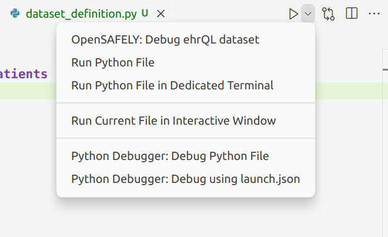
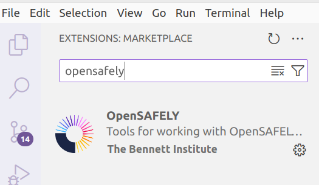
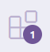
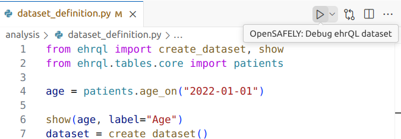
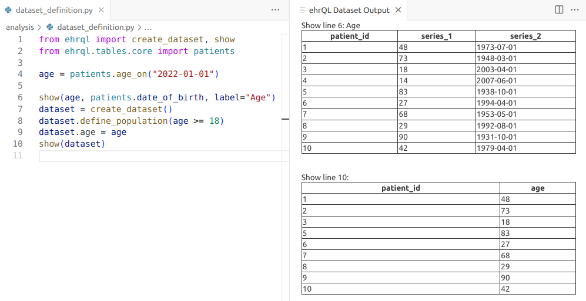

# The OpenSAFELY VS Code Extension

This page describes how to install and use the OpenSAFELY VS Code extension to assist in
learning and writing ehrQL.

## What does the extension do?

It uses a set of local dummy tables to allow you to inspect the contents of ehrQL tables, columns,
datasets and queries. This means you can use known data (the contents of your dummy tables) to
check if your ehrQL queries are extracting data as you expect.

e.g. given a dummy patient table

|patient_id|date_of_birth|
|----------|-------------|
|1         | 1990-01-01  |
|2         | 1980-01-01  |

```py
show(patients.age_on("2020-01-01"))
```
would display

|patient_id|value|
|----------|-----|
|1         | 30  |
|2         | 20  |

## Installation

### Check if the extension is already installed

You can check if the extension is already installed by opening an ehrQL dataset definition
file in VS Code. With the file open, click on the the dropdown next to the Run button. If the extension is installed, the first (default) option in the dropdown menu will be "OpenSAFELY: Debug ehrQL dataset".


### Working in Codespaces
If you are [creating a new repo from the research template](https://docs.opensafely.org/getting-started/tutorial/create-a-github-repository/), the extension will already be
installed when you start up a codespace.

If you have an existing repo that does not have the extension installed, follow the
[instructions to update your codespace](https://docs.opensafely.org/getting-started/how-to/update-github-codespaces-in-your-project/).

### Working locally on your own computer

Click on the Extensions icon in the left hand menu bar in VS Code, or go to
File > Preferences > Extensions.


This will display a list of installed and available
extensions. Search for "opensafely" to find the OpenSAFELY extension.



### Updating the extension
In a Codespace, updates to the extension will be installed automatically the next time
your codespace starts up. Locally, you will see a notification on the Extensions icon when
you have extensions with updates available, and you will need to manually click on the
"Restart extension" button link to install the updated extension.


## Using the extension

### Dummy tables

The extension requires a folder containing dummy tables. By default, this is expected
to be called `dummy_tables`, and located at the top level of your study repo folder. The
location can be configured in the extension settings.

ehrQL provides some example data for the core ehrQL tables, which you can fetch by
running
```
opensafely exec ehrql:v1 dump-example-data
```

This will create a folder called `example-data`, which you can rename to `dummy_tables` for
use by the extension.

Alternatively you can [supply your own dummy tables](../how-to/dummy-data.md#supply-your-own-dummy-tables) or use your dataset definition to
[generate dummy tables for you](../how-to/dummy-data.md#generating-dummy-tables).

To generate dummy tables from a dataset definition, `dataset_definition.py`, and
save them to a folder called `dummy_tables`:
```
opensafely exec ehrql:v1 create-dummy-tables dataset_definition.py dummy_tables
```

### The show() function

We can show the contents of an ehrQL dataset, table, column or query by using the `show()`.

Import the function:

```py
from ehrql import show
```
Show the contents of an ehrQL element:
```py
show(<element>)
```

Click on the Run button, or Ctrl+Shift+P and select the "OpenSAFELY: Debug ehrQL dataset"
command.


The following dataset definition filters patients to only those over 18, and shows the
`age` variable and the corresponding date of birth value from the `patients` table (with an optional label), and the final dataset output.

```ehrql
from ehrql import create_dataset, show
from ehrql.tables.core import patients

age = patients.age_on("2022-01-01")

show(age, patients.date_of_birth, label="Age")
dataset = create_dataset()
dataset.define_population(age >= 18)
dataset.age = age
show(dataset)
```

Running the extension opens an adjacent panel to display the contents of the `show()` calls.



### Showing multiple variables

As we saw in the example above, `show()` can be called with multiple ehrQL elements; in this
case, `age`, and `date_of_birth` from the `patients` table. These both contain one row per
patient, and are shown in a single table.

We can `show()` any number of one-row-per-patient ehrQL series in a single output table, e.g.:

```py
show(patients.sex, clinical_events.count_for_patient())
```

Or multiple many-rows-per-patient ehrQL series, *as long as they come from the same table*.

```py
show(clinical_events.date, clinical_events.numeric_value)
```

### Troubleshooting

#### Invalid combinations of elements
Attempting to use `show()` with a combination of one-row-per-patient and many-rows-per-patient
series with raise an error.

e.g. The following is invalid:
```py
show(patients.sex, clinical_events.date)
```

Instead, show these series separately:
```py
show(patients.sex)
show(clinical_events.date)
```

The tables will be displayed one after another in the output panel.

#### Errors in ehrQL

If you write some invalid ehrQL in your dataset definition, you will see an error message
printed to the display panel:

```py
show(
    medications.where(medications.date >= "2016-01-01").sort_by(medications.dat).first_for_patient()
)
```

```
Error loading file 'dataset_definition.py':

Traceback (most recent call last):
  File "/home/becky/datalab/ehrql/dataset_definition.py", line 21, in <module>
    medications.where(medications.date >= "2016-01-01").sort_by(medications.dat).first_for_patient()
                                                                ^^^^^^^^^^^^^^^
AttributeError: 'medications' object has no attribute 'dat'
```

:grey_question: Can you work out what this is telling us?

Refer to [the catalogue of errors](../how-to/errors.md) for details of common error messages and what they mean.
