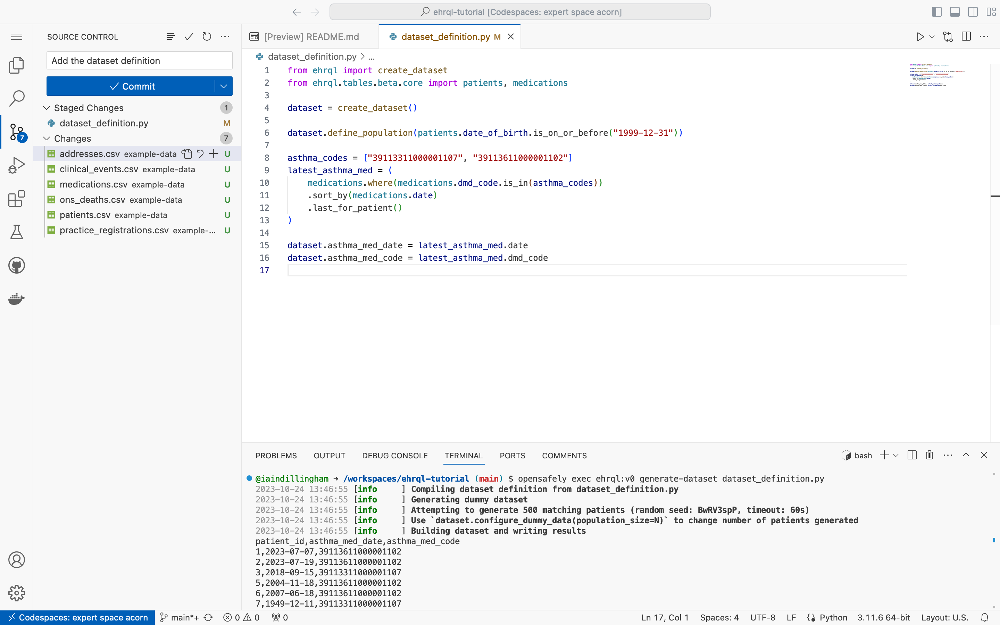

In this section, you will commit the dataset definition.
A *commit* records one or more changes to the repository.

## Commit the dataset definition

1. Click the Source Control icon towards the left of the codespace

1. Click the Stage Changes icon next to `dataset_definition.py`

1. Enter *Add the dataset definition* into the Message box

    

1. Click **Commit**
