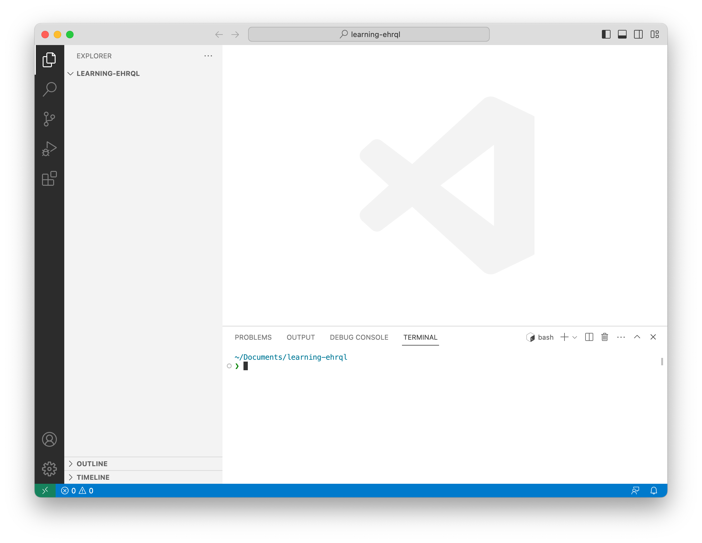
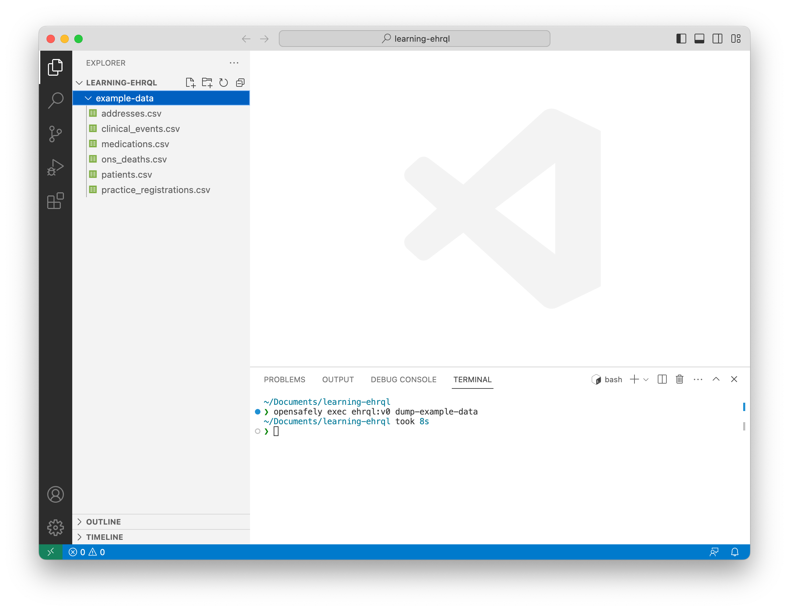

In this section, you will generate dummy **input** data that you will use in later sections.

## Create and open a new folder

From the menu, using **Open Folder**, create and open a new folder called *learning-ehrql*.



## Generate dummy input data

In the terminal, type

```
opensafely exec ehrql:v0 dump-example-data
```

and press ++enter++.

Click the *example-data* folder in the explorer.
Notice that it contains several CSV files.
Each CSV file contains dummy input data.


