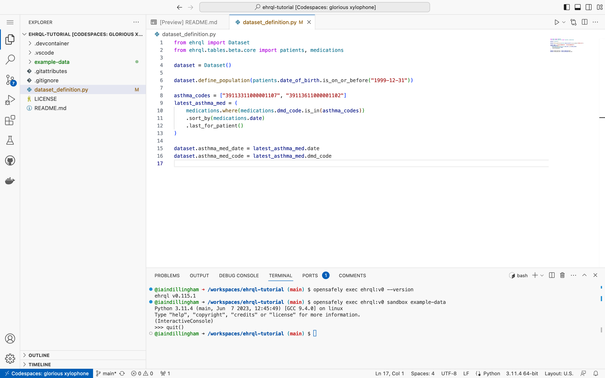

In this section, you will generate dummy **output** data.

## Exit the sandbox

Exit the sandbox and return to the terminal.

```pycon
>>> quit()
```



## Generate dummy output data

In the terminal, type

```
opensafely exec ehrql:v0 generate-dataset dataset_definition.py
```

and press ++enter++.

The terminal will fill with dummy output data in CSV format.
Scroll up to see the column headers;
notice that two column headers correspond to the two patient series
— `asthma_med_date` and `asthma_med_code` —
that you added to the dataset definition.

Also notice the lines that start with `[info]`.
These show that the dummy data generator generated dummy data for 5,000 patients;
found 500 that matched the dataset definition;
and displayed them in the terminal.


