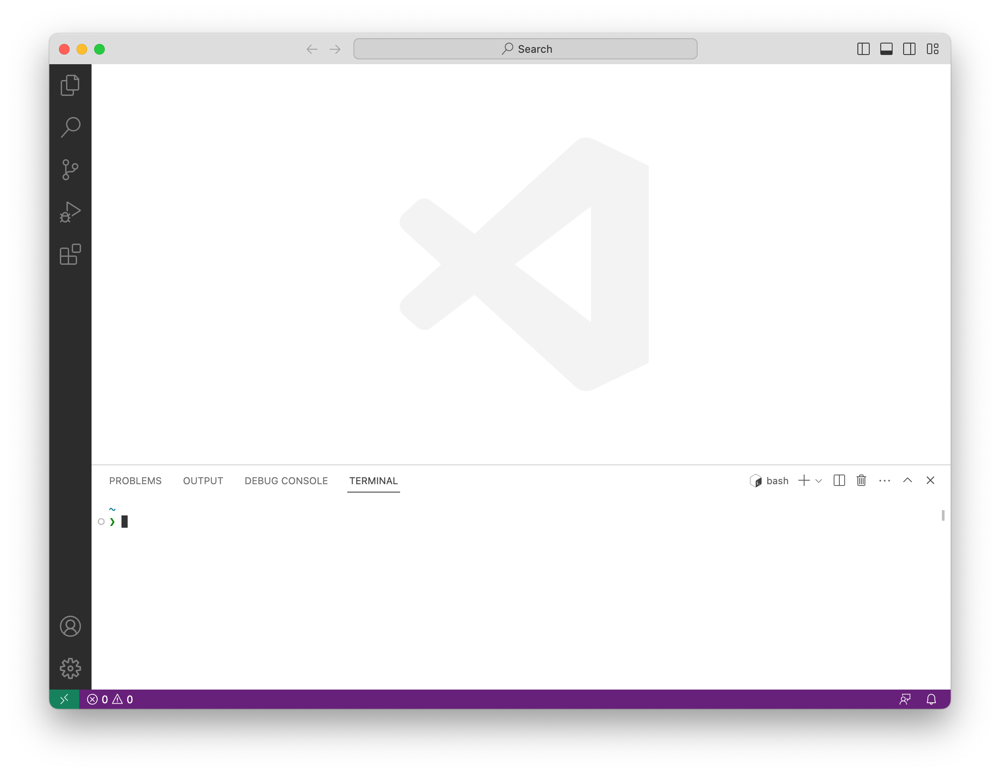

In this section, you will install ehrQL.

## Prerequisites

You should install
[Docker](https://docs.opensafely.org/install-docker/) and
[the OpenSAFELY CLI](https://docs.opensafely.org/opensafely-cli/)
before you install ehrQL.
You should install [VS Code](https://code.visualstudio.com/),
a code editor, to complete the tutorial.

## Open the terminal

VS Code includes a terminal.
There are several ways to open it.
We will do so from the menu, using **Terminal > New Terminal** or **View > Terminal**.



## Upgrade the OpenSAFELY CLI

If you previously installed the OpenSAFELY CLI,
then upgrade it to the latest version.
In the terminal, type

```
opensafely upgrade
```

and press ++enter++.


## Install ehrQL

In the terminal, type

```
opensafely pull ehrql
```

and press ++enter++.


## Check ehrQL was installed correctly

In the terminal, type:

```
opensafely exec ehrql:v0 --version
```

And press ++enter++.


