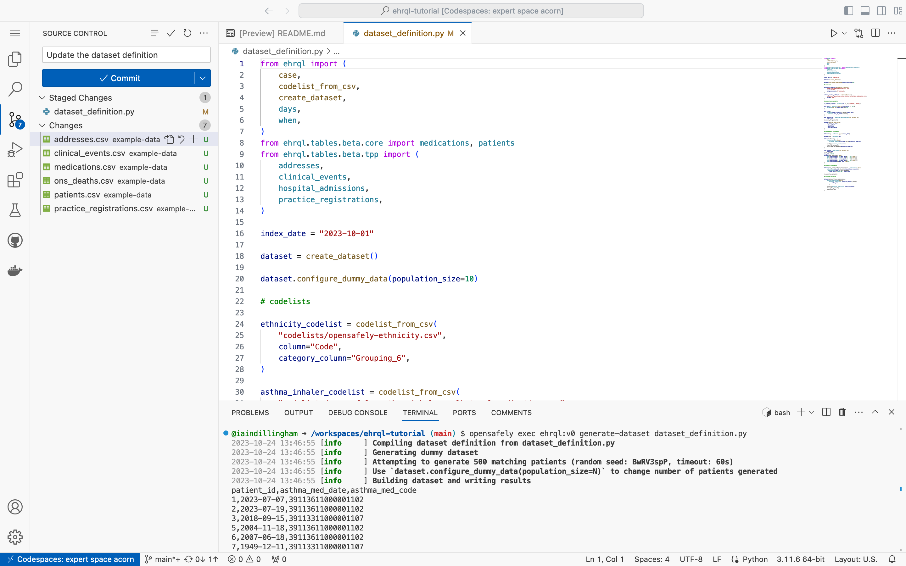

In this section,
you will commit the dataset definition and push the commits to GitHub.

## Commit and push

1. Click the Source Control icon towards the left of the codespace

1. Click the Stage Changes icon next to `dataset_definition.py`

1. Enter *Update the dataset definition* into the Message box

    

1. Click **⋁** towards the right of **Commit**

1. Click **Commit & Push**
