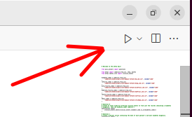

!!! abstract inline end "Feedback"
    You finished the tutorial - well done!. Either now, or after you've tried the quiz, we'd love it if you could fill in this very short [feedback form][1]{:target="_blank"}.

To test your understanding of ehrQL, the tutorial repository contains a file (called `quiz.py`) with some gaps for you to fill in.

Open the file now in your Codespace.
You will see lots of lines like `questions[3].check(...)`.
To work through the quiz, you'll have to replace the `...`s with an ehrQL object (a series, frame, or dataset).
You'll see that the first question has been answered for you.

You can check your answers by pressing CTRL-SHIFT-ENTER, or by clicking the play button in the top right:



(You may need to use the drop-down next to the play button in order to select "OpenSAFELY: Debug ehrQL dataset")

.


You should see output matching the following:

```
Question 0
Correct!

Question 1
Skipped.

Question 2
Skipped.

...

Summary of your results
Correct: 1
Incorrect: 0
Unanswered: 11
```

To work through the quiz, we suggest trying to answer the questions one-by-one, and checking your answers after each question.

If you get stuck, you can type `questions[7].hint()` into the `quiz.py` file, and run it to display a hint.

Many questions build on the answers to previous questions, so you should consider giving names to some of your objects.

The quiz takes you through categorising patients according to two other (simplified) QOF business rules:

**DM014** Identify the patients who have been diagnosed with diabetes for the first time in the past year and who have a record of being referred to a structured education programme within nine months after their diagnosis.

0: Create an event frame by filtering `clinical_events` to find just the records indicating a diabetes diagnosis. (Use the `diabetes_codes` codelist.)

1: Create a patient series containing the date of each patient's earliest diabetes diagnosis.

2: Create a patient series containing the date of each patient's earliest structured education programme referral. (Use the `referral_code` codelist.)

3: Create a boolean patient series indicating whether the date of each patient's earliest diabetes diagnosis was between 1st April 2023 and 31st March 2024. If the patient does not have a diagnosis, the value in this series should be `False`.

4: Create a patient series indicating the number of months between a patient's earliest diagnosis and their earliest referral.

5: Create a boolean patient series identifying patients who have been diagnosed with diabetes for the first time in the year between 1st April 2023 and 31st March 2024, and who have a record of being referred to a structured education programme within nine months after their diagnosis.

**DM020** Identify patients without moderate or severe frailty in whom the last IFCC-HbA1c is 58 mmol/mol or less in the preceding twelve months.

6: Create a patient series with the date of the latest record of mild frailty for each patient.

7: Create a patient series with the date of the latest record of moderate or severe frailty for each patient.

8: Create a boolean patient series indicating whether a patient's last record of severity is moderate or severe. If the patient does not have a record of frailty, the value in this series should be `False`.

9: Create a patient frame containing the latest HbA1c measurement for each patient.

10: Create a boolean patient series identifying patients without moderate or severe frailty in whom the last IFCC-HbA1c is 58 mmol/mol or less.

[1]: https://docs.google.com/forms/d/e/1FAIpQLSeouuTXPnwShAjBllyln4tl2Q52PMG_aUhpma4odpE2MmCngg/viewform
