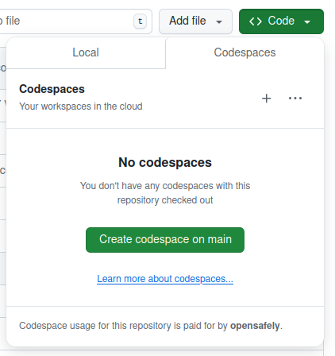
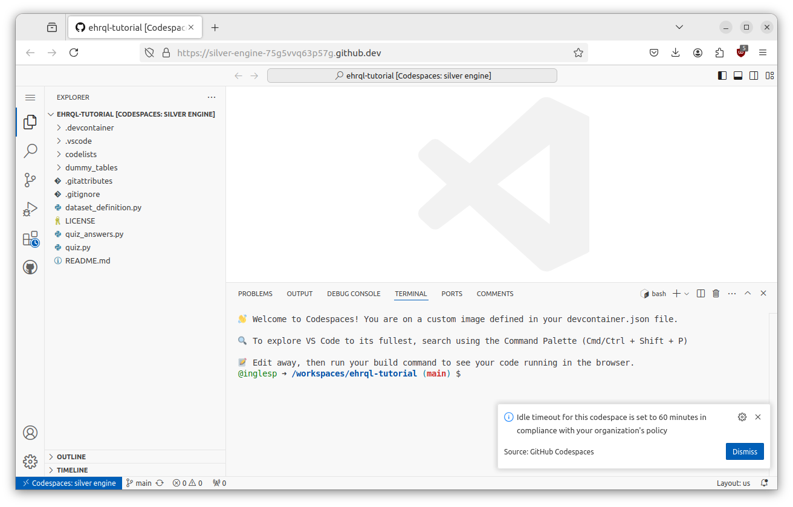
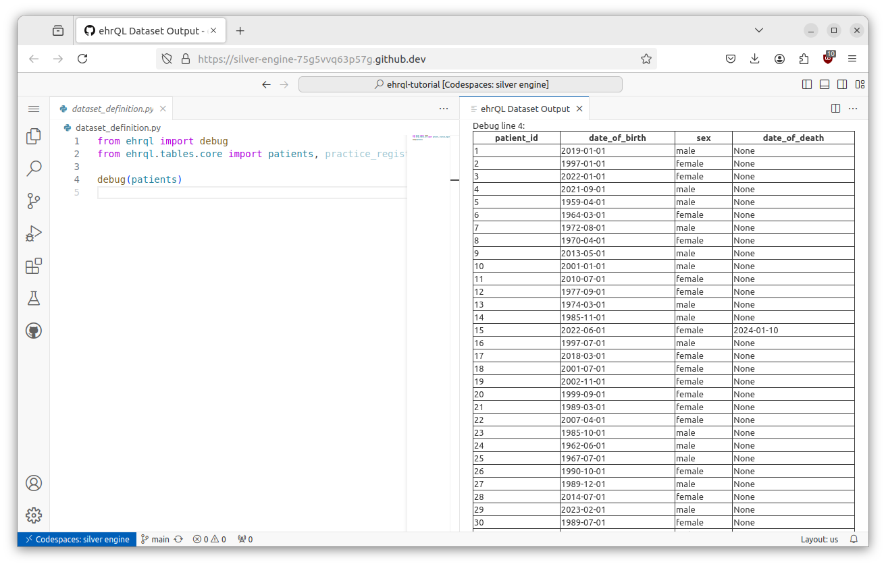

In this section, you will set up everything you need to complete the tutorial.

## Prerequisites

You should have a GitHub personal account.
See the "[Signing up for a new GitHub account][1]" page in the GitHub docs.

## Cloning the template repository

To start, clone the tutorial repository into your own GitHub account by clicking the following link: [https://github.com/opensafely/ehrql-tutorial/generate]. 

Leave the "Include all branches" option unchecked, and, using the _Owner_ drop-down menu, select your GitHub account as the owner.

Enter `ehrql-tutorial` as the name for your repository, and "The OpenSAFELY ehrQL tutorial" as the description of your repository.

Choose "Public" as the [repository visibility](https://docs.opensafely.org/repositories/#repository-visibility). Finally, click _Create repository from template_.

The new GitHub repository will take a moment to initialise, as it is running some setup in background. Wait about 1 minute, then reload the page.

## Starting a new Codespace

To work through this tutorial, you will need to use Codespaces.

??? tip "What's a Codespace?"
    A [Codespace][3] is cloud-hosted environment where you can write and run code.

    For more information, see our blog post: [Research-ready computers in the cloud][4].

To launch a new Codespace, go to your new `ehrql-tutorial` repository in your browser, click the green _Code_ button, ensure the _Codespaces_ tab is active, and click the _Create codespace on main_ button.

A new browser tab will open and you'll see a notification in the bottom right of the screen saying "Building codespace..."

After a minute or two you'll see a screen that looks like this:

??? Warning "Firefox users may have to disable Enhanced Tracking Protection"
    If you see a message that says "Oh no, it looks like you are offline!" and you use Firefox, you will need to disable Enhanced Tracking Protection, which can be done via the shield icon to the left of the address bar:

    

You can dismiss any notifications, and close the terminal tab by clicking on the cross icon halfway up the screen on the right hand side.

To make sure everything's working correctly, open `dataset_definition.py` by clicking on it in the _Explorer_ tab on the left hand side, and then click the _Run_ button.

You should see a new window showing a table showing the contents of the `patients` table:

If you don't see this, get in touch with the OpenSAFELY tech team via your copilot, or by emailing tech@opensafely.org.

Next: [Working with data with ehrQL](../working-with-data-with-ehrql/index.md)

[1]: https://docs.github.com/en/get-started/start-your-journey/creating-an-account-on-github
[2]: https://github.com/opensafely/ehrql-tutorial/
[3]: https://docs.github.com/en/codespaces/overview
[4]: https://www.bennett.ox.ac.uk/blog/2024/07/research-ready-computers-in-the-cloud/
