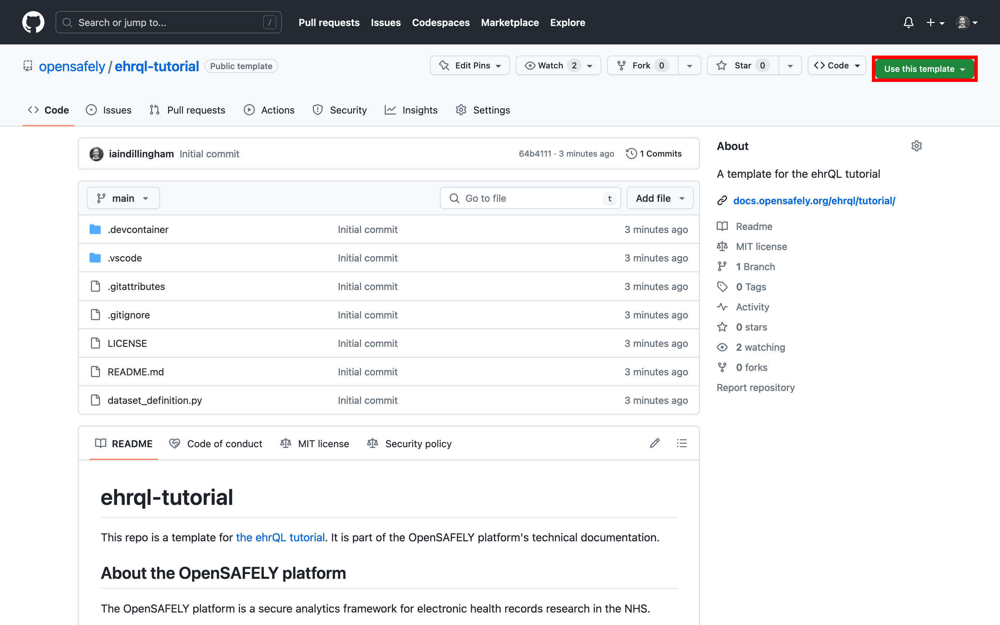
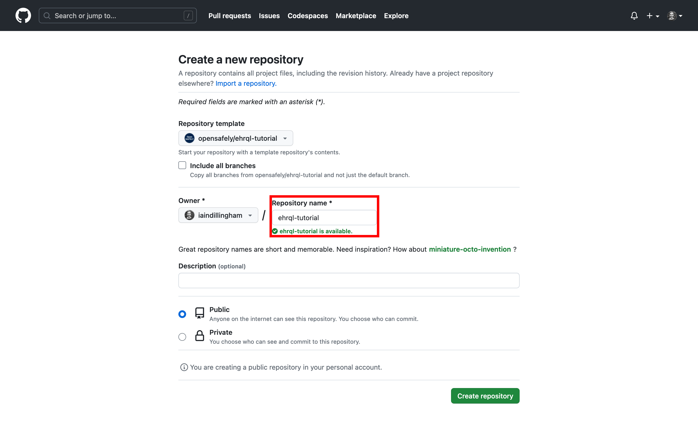
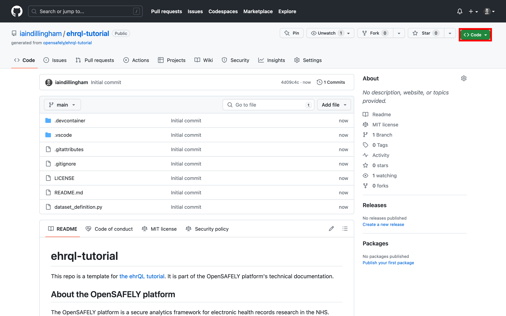
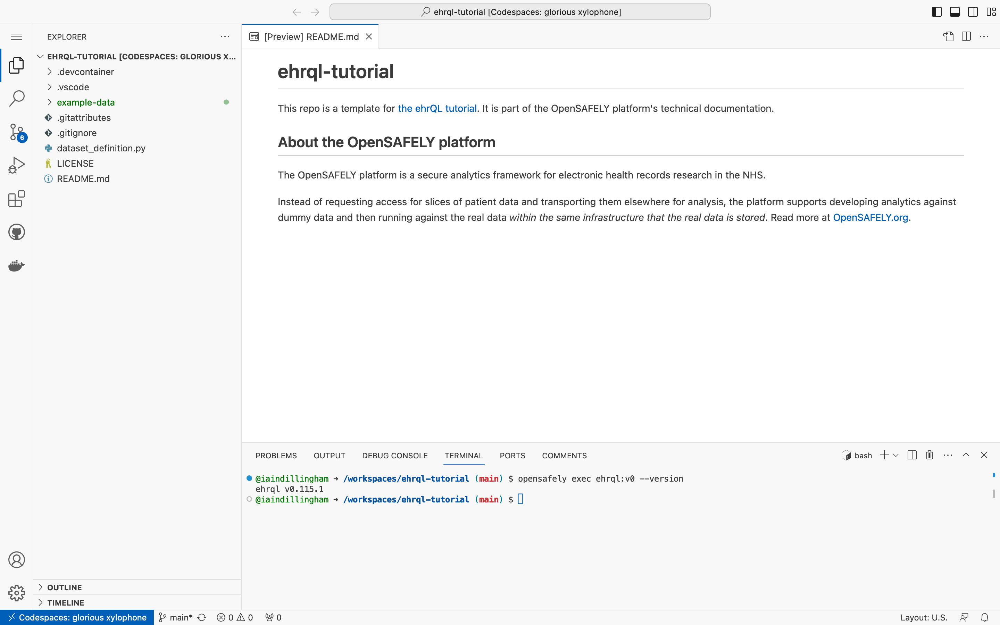

In this section, you will set up everything you need to complete the tutorial.

## Prerequisites

You should have a GitHub personal account.
See the "[Signing up for a new GitHub account][1]" page in the GitHub docs.

## Create a new repository

In this section, you will create a new repository from a template.
The new repository will live within your personal account;
the template lives within the opensafely organization.

1. Visit <a target="_blank" href="https://github.com/opensafely/ehrql-tutorial">https://github.com/opensafely/ehrql-tutorial</a>

1. Click **Use this template**

    

1. Click **Create a new repository**

1. Name the new repository *ehrql-tutorial*

    

1. Click **Create repository**

The new repository will live within your personal account.

## Create a codespace

In this section, you will create a codespace for working with the *ehrql-tutorial* repository.
A *codespace* is a development environment that's hosted in the cloud.

1. Click **< > Code**

    

1. Click **Codespaces**

1. Click **Create codespace on main**

It will take roughly two minutes to create the codespace,
which will open in a new tab.

## Run an OpenSAFELY command

In this section, you will run an OpenSAFELY command to test that the codespace is working correctly.

Towards the bottom of the codespace, you will see the terminal.

??? tip "The terminal"
    The terminal allows you to interact with programs,
    such as ehrQL,
    that have command line interfaces.
    Whilst *terminal* and *shell* are often used synonymously,
    a shell runs within a terminal.

    You may have used a shell before:
    Git Bash, for example, bundles Git with the Bash shell for the Windows operating system.
    The codespace's default shell is also the Bash shell,
    so if you've used Git Bash before,
    then you'll find the codespace's default shell familiar.

In the terminal, type

```
opensafely exec ehrql:v1 --version
```

and press ++enter++.



The codespace is working correctly.

??? tip "The anatomy of an OpenSAFELY command"
    What do the parts of the OpenSAFELY command
    `opensafely exec ehrql:v1 --version`
    do?

    * `opensafely exec` executes an OpenSAFELY action independently of other OpenSAFELY actions
    * `ehrql` is the OpenSAFELY action to execute
    * `v1` is the major version of the ehrQL action
    * `--version` instructs the ehrQL action to display its full version

[1]: https://docs.github.com/en/get-started/signing-up-for-github/signing-up-for-a-new-github-account
