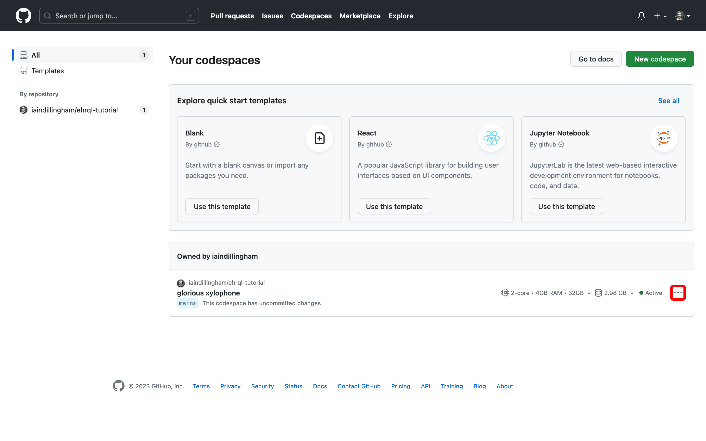

In this section, you will delete the *ehrql-tutorial* codespace.

## Delete the *ehrql-tutorial* codespace

1. Visit <https://github.com/codespaces/>

1. Click the menu icon next to the *ehrql-tutorial* codespace

    

1. Click **Delete**

The *ehrql-tutorial* codespace is deleted.

## Congratulations!

Congratulations!
You have completed the tutorial.
