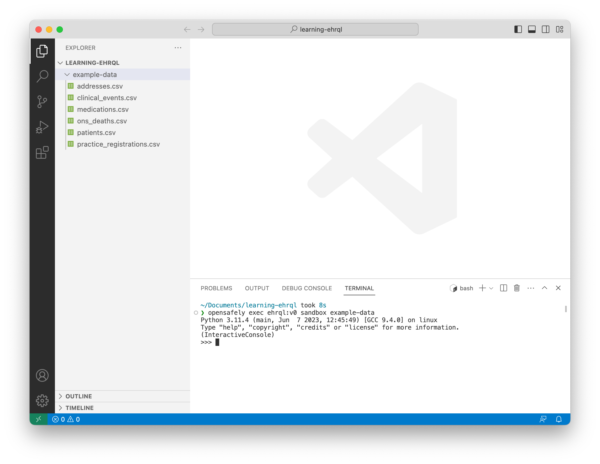

In this section, you will work with tables in the sandbox.

## Start the sandbox

In the terminal, type

```
opensafely exec ehrql:v0 sandbox example-data
```

and press ++enter++.



Notice that the *command prompt*,
or the set of characters before the cursor,
has changed to `>>>`.
For the remainder of this section,
when you see `>>>`,
you should type the code that follows into the sandbox and press ++enter++.

## Work with patient data

In most cases, there is one source of patient data: the `patients` table.
To work with the `patients` table,
first import it into the sandbox.

```pycon
>>> from ehrql.tables.beta.core import patients
```

The `patients` table has one row per patient.
Notice that all values in the `patient_id` column are unique.

```pycon
>>> patients
patient_id        | date_of_birth     | sex               | date_of_death
------------------+-------------------+-------------------+------------------
0                 | 1973-07-01        | female            | 2015-09-14
1                 | 1948-03-01        | male              | None
2                 | 2003-04-01        | male              | None
3                 | 2007-06-01        | female            | None
4                 | 1938-10-01        | male              | 2018-05-23
5                 | 1994-04-01        | female            | None
6                 | 1953-05-01        | male              | None
7                 | 1992-08-01        | female            | None
8                 | 1931-10-01        | female            | 2017-11-10
9                 | 1979-04-01        | male              | None
```

Similarly, the `patients.date_of_birth` column has one row per patient.
(If a table has one row per patient, then a column from the table must also have one row per patient.)

```pycon
>>> patients.date_of_birth
0 | 1973-07-01
1 | 1948-03-01
2 | 2003-04-01
3 | 2007-06-01
4 | 1938-10-01
5 | 1994-04-01
6 | 1953-05-01
7 | 1992-08-01
8 | 1931-10-01
9 | 1979-04-01
```

## Work with event data

Unlike patient data, there are many sources of event data:
the `medications` table, for example.
To work with the `medications` table,
first import it into the sandbox.

```pycon
>>> from ehrql.tables.beta.core import medications
```

The `medications` table has many rows per patient.
Notice that some values in the `patient_id` column are not unique.

```pycon
>>> medications
patient_id        | row_id            | date              | dmd_code
------------------+-------------------+-------------------+------------------
0                 | 0                 | 2014-01-11        | 39113611000001102
1                 | 1                 | 2015-08-06        | 39113611000001102
1                 | 2                 | 2018-09-21        | 39113311000001107
1                 | 3                 | 2020-05-17        | 22777311000001105
3                 | 4                 | 2022-11-09        | 22777311000001105
4                 | 5                 | 2017-05-11        | 39113611000001102
5                 | 6                 | 2017-07-11        | 3484711000001105
5                 | 7                 | 2019-07-06        | 39113611000001102
7                 | 8                 | 2021-01-27        | 3484711000001105
9                 | 9                 | 2015-03-14        | 3484711000001105
```

Similarly, the `medications.date` column has many rows per patient.

```pycon
>>> medications.date
0 | 0 | 2014-01-11
1 | 1 | 2015-08-06
1 | 2 | 2018-09-21
1 | 3 | 2020-05-17
3 | 4 | 2022-11-09
4 | 5 | 2017-05-11
5 | 6 | 2017-07-11
5 | 7 | 2019-07-06
7 | 8 | 2021-01-27
9 | 9 | 2015-03-14
```

## Transform tables into a dataset

Your task, as a researcher, is to transform tables
— such as `patients` and `medications` —
into a dataset.

### Transform event data into patient data

To transform event data into patient data:

1. Sort the event data
2. Select either the first row or the last row of the event data

```pycon
>>> medications.sort_by(medications.date).first_for_patient()
patient_id        | date              | dmd_code
------------------+-------------------+------------------
0                 | 2014-01-11        | 39113611000001102
1                 | 2015-08-06        | 39113611000001102
3                 | 2022-11-09        | 22777311000001105
4                 | 2017-05-11        | 39113611000001102
5                 | 2017-07-11        | 3484711000001105
7                 | 2021-01-27        | 3484711000001105
9                 | 2015-03-14        | 3484711000001105
```

### Filter event data

To filter event data,
select rows that match or do not match a condition.

Rows that match 100mcg/dose Salbutamol:

```pycon
>>> medications.where(medications.dmd_code == "39113611000001102")
patient_id        | row_id            | date              | dmd_code
------------------+-------------------+-------------------+------------------
0                 | 0                 | 2014-01-11        | 39113611000001102
1                 | 1                 | 2015-08-06        | 39113611000001102
4                 | 5                 | 2017-05-11        | 39113611000001102
5                 | 7                 | 2019-07-06        | 39113611000001102
```

Rows that do not match 100mcg/dose Salbutamol:

```pycon
>>> medications.except_where(medications.dmd_code == "39113611000001102")
patient_id        | row_id            | date              | dmd_code
------------------+-------------------+-------------------+------------------
1                 | 2                 | 2018-09-21        | 39113311000001107
1                 | 3                 | 2020-05-17        | 22777311000001105
3                 | 4                 | 2022-11-09        | 22777311000001105
5                 | 6                 | 2017-07-11        | 3484711000001105
7                 | 8                 | 2021-01-27        | 3484711000001105
9                 | 9                 | 2015-03-14        | 3484711000001105
```

### Extract a column of years from a column of dates

To extract a column of years from a column of dates,
append `.year` to the column of dates.

```pycon
>>> patients.date_of_birth.year
0 | 1973
1 | 1948
2 | 2003
3 | 2007
4 | 1938
5 | 1994
6 | 1953
7 | 1992
8 | 1931
9 | 1979
```

### Add one or more years to a column of dates

To add one or more years to a column of dates,
use the `years` function.

```pycon
>>> from ehrql import years
>>> patients.date_of_birth + years(1)
0 | 1974-07-01
1 | 1949-03-01
2 | 2004-04-01
3 | 2008-06-01
4 | 1939-10-01
5 | 1995-04-01
6 | 1954-05-01
7 | 1993-08-01
8 | 1932-10-01
9 | 1980-04-01
```
