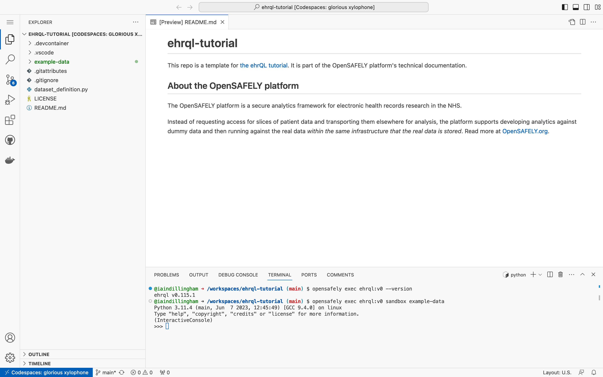

In this section, you will work with tables in the sandbox.
The *sandbox* is an environment for experimenting with ehrQL
that contains a small amount of dummy data. By default, the
sandbox uses the CSV files in `example-data` as dummy data.

## Start the sandbox

In the terminal, type

```
opensafely exec ehrql:v1 sandbox
```

and press ++enter++.



Notice that the *command prompt*,
or the set of characters before the cursor,
has changed to `>>>`.
For the remainder of this section,
when you see `>>>`,
you should type the code that follows into the sandbox and press ++enter++.

## Work with patient data

In most cases, there is one source of patient data: the `patients` table.
To work with the `patients` table,
first import it into the sandbox.

```pycon
>>> from ehrql.tables.core import patients
```

??? tip "Importing tables into the sandbox"
    Importing a table into the sandbox doesn't display any output.
    In other words, typing

    ```pycon
    >>> from ehrql.tables.core import patients
    ```

    into the sandbox and pressing ++enter++ displays

    ```pycon
    >>>
    ```

The `patients` table has one row per patient.
Notice that all values in the `patient_id` column are unique.

```pycon
>>> patients
patient_id        | date_of_birth     | sex               | date_of_death
------------------+-------------------+-------------------+------------------
1                 | 1973-07-01        | female            | 2015-09-14
2                 | 1948-03-01        | male              | None
3                 | 2003-04-01        | male              | None
4                 | 2007-06-01        | female            | None
5                 | 1938-10-01        | male              | 2018-05-23
6                 | 1994-04-01        | female            | None
7                 | 1953-05-01        | male              | None
8                 | 1992-08-01        | female            | None
9                 | 1931-10-01        | female            | 2017-11-10
10                | 1979-04-01        | male              | None
```

Similarly, the `patients.date_of_birth` column has one row per patient.
(If a table has one row per patient, then a column from the table must also have one row per patient.)
Notice that the column is indexed by `patient_id`.

```pycon
>>> patients.date_of_birth
 1 | 1973-07-01
 2 | 1948-03-01
 3 | 2003-04-01
 4 | 2007-06-01
 5 | 1938-10-01
 6 | 1994-04-01
 7 | 1953-05-01
 8 | 1992-08-01
 9 | 1931-10-01
10 | 1979-04-01
```

## Work with event data

Unlike patient data, there are many sources of event data:
the `medications` table, for example.
To work with the `medications` table,
first import it into the sandbox.

```pycon
>>> from ehrql.tables.core import medications
```

The `medications` table has many rows per patient.
Notice that some values in the `patient_id` column are not unique,
but that all values in the `row_id` column are unique.

```pycon
>>> medications
patient_id        | row_id            | date              | dmd_code
------------------+-------------------+-------------------+------------------
1                 | 1                 | 2014-01-11        | 39113611000001102
2                 | 2                 | 2015-08-06        | 39113611000001102
2                 | 3                 | 2018-09-21        | 39113311000001107
2                 | 4                 | 2020-05-17        | 22777311000001105
4                 | 5                 | 2022-11-09        | 22777311000001105
5                 | 6                 | 2017-05-11        | 39113611000001102
6                 | 7                 | 2017-07-11        | 3484711000001105
6                 | 8                 | 2019-07-06        | 39113611000001102
8                 | 9                 | 2021-01-27        | 3484711000001105
10                | 10                | 2015-03-14        | 3484711000001105
```

Similarly, the `medications.date` column has many rows per patient.
Notice that the column is indexed by `patient_id` and `row_id`.

```pycon
>>> medications.date
 1 |  1 | 2014-01-11
 2 |  2 | 2015-08-06
 2 |  3 | 2018-09-21
 2 |  4 | 2020-05-17
 4 |  5 | 2022-11-09
 5 |  6 | 2017-05-11
 6 |  7 | 2017-07-11
 6 |  8 | 2019-07-06
 8 |  9 | 2021-01-27
10 | 10 | 2015-03-14
```

## Transform tables into a dataset

Your task, as a researcher, is to transform tables
— such as `patients` and `medications` —
into a dataset that is suitable for analysis.

??? tip "Tables and datasets"
    In ehrQL, **tables and datasets perform different functions**.
    Whilst both can be represented as rows and columns,
    a *dataset* is a group of patients with common statistical characteristics.
    In other words, a *dataset* is a *cohort*.

### Transform event data into patient data

To transform event data into patient data:

1. Sort the event data
2. Select either the first row or the last row of the event data

```pycon
>>> medications.sort_by(medications.date).first_for_patient()
patient_id        | date              | dmd_code
------------------+-------------------+------------------
1                 | 2014-01-11        | 39113611000001102
2                 | 2015-08-06        | 39113611000001102
4                 | 2022-11-09        | 22777311000001105
5                 | 2017-05-11        | 39113611000001102
6                 | 2017-07-11        | 3484711000001105
8                 | 2021-01-27        | 3484711000001105
10                | 2015-03-14        | 3484711000001105
```

### Filter event data

To filter event data,
select rows that match or do not match a condition.

Rows that match 100mcg/dose Salbutamol:

```pycon
>>> medications.where(medications.dmd_code == "39113611000001102")
patient_id        | row_id            | date              | dmd_code
------------------+-------------------+-------------------+------------------
1                 | 1                 | 2014-01-11        | 39113611000001102
2                 | 2                 | 2015-08-06        | 39113611000001102
5                 | 6                 | 2017-05-11        | 39113611000001102
6                 | 8                 | 2019-07-06        | 39113611000001102
```

Rows that do not match 100mcg/dose Salbutamol:

```pycon
>>> medications.except_where(medications.dmd_code == "39113611000001102")
patient_id        | row_id            | date              | dmd_code
------------------+-------------------+-------------------+------------------
2                 | 3                 | 2018-09-21        | 39113311000001107
2                 | 4                 | 2020-05-17        | 22777311000001105
4                 | 5                 | 2022-11-09        | 22777311000001105
6                 | 7                 | 2017-07-11        | 3484711000001105
8                 | 9                 | 2021-01-27        | 3484711000001105
10                | 10                | 2015-03-14        | 3484711000001105
```

### Extract a column of years from a column of dates

To extract a column of years from a column of dates,
append `.year` to the column of dates.

```pycon
>>> patients.date_of_birth.year
 1 | 1973
 2 | 1948
 3 | 2003
 4 | 2007
 5 | 1938
 6 | 1994
 7 | 1953
 8 | 1992
 9 | 1931
10 | 1979
```

### Add one or more years to a column of dates

To add one or more years to a column of dates,
use the `years` function.

```pycon
>>> from ehrql import years
>>> medications.date + years(1)
 1 |  1 | 2015-01-11
 2 |  2 | 2016-08-06
 2 |  3 | 2019-09-21
 2 |  4 | 2021-05-17
 4 |  5 | 2023-11-09
 5 |  6 | 2018-05-11
 6 |  7 | 2018-07-11
 6 |  8 | 2020-07-06
 8 |  9 | 2022-01-27
10 | 10 | 2016-03-14
```
