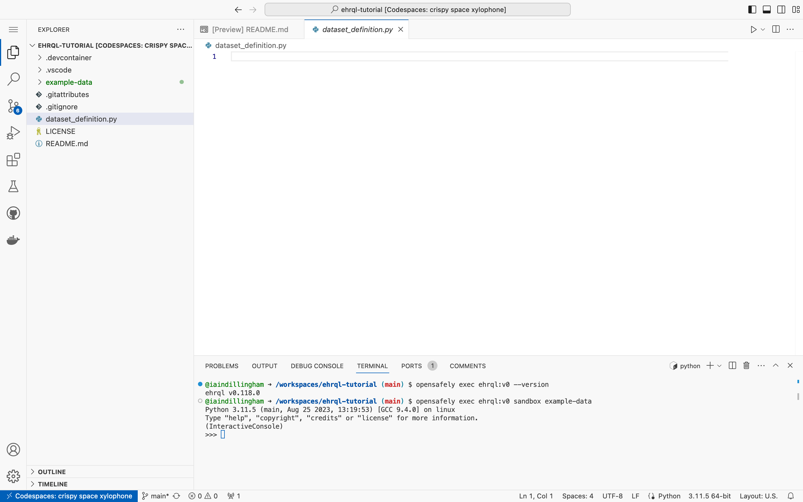
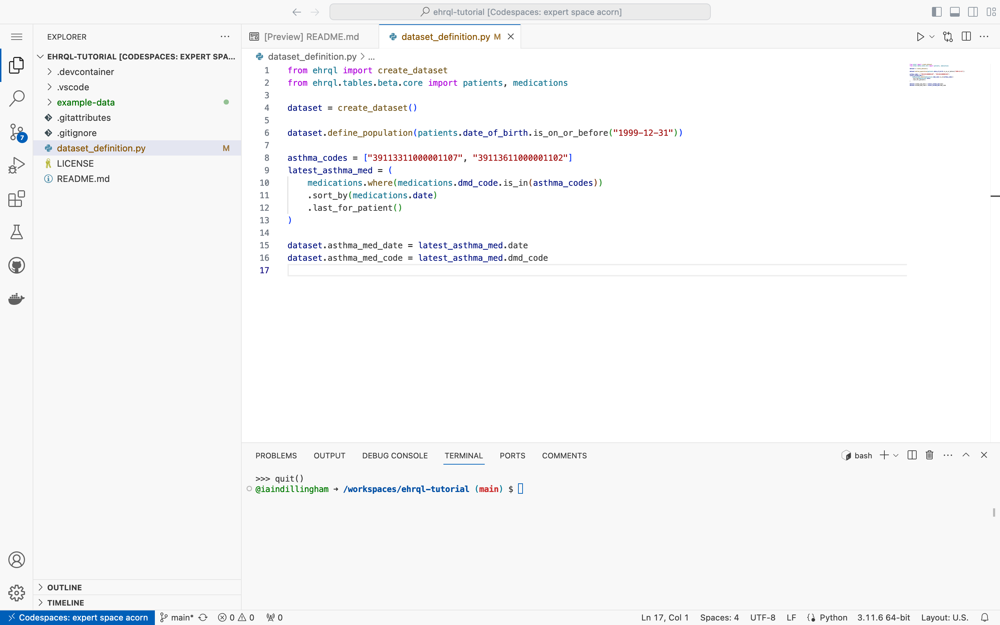

In this section, you will write the following dataset definition.
It selects the date and the code of each patient's most recent asthma medication,
for all patients born on or before 31 December 1999.

```ehrql
from ehrql import create_dataset
from ehrql.tables.core import patients, medications

dataset = create_dataset()

dataset.define_population(patients.date_of_birth.is_on_or_before("1999-12-31"))

asthma_codes = ["39113311000001107", "39113611000001102"]
latest_asthma_med = (
    medications.where(medications.dmd_code.is_in(asthma_codes))
    .sort_by(medications.date)
    .last_for_patient()
)

dataset.asthma_med_date = latest_asthma_med.date
dataset.asthma_med_code = latest_asthma_med.dmd_code
```

!!! tip "Importing tables"
    The tables are imported from the `ehrql.tables.core` schema in the above dataset definition.
    Consequently, it can be run on any backend.
    If you need a table that's only available in one backend,
    then you should import the table from a non-core schema,
    such as `ehrql.tables.tpp` or `ehrql.tables.emis`.

## Open the dataset definition

1. Click `dataset_definition.py` in the Explorer towards the top left of the codespace



For the remainder of this section,
you should type the code into `dataset_definition.py`.

??? tip "Interact with the code in the sandbox"
    As well as typing the code into `dataset_definition.py`,
    you can interact with the code in the sandbox.
    Remember, when you see `>>>`,
    you should type the code that follows into the sandbox and press ++enter++.

## Import the `create_dataset` function

```python
from ehrql import create_dataset
```

??? tip "Import the `create_dataset` function into the sandbox"
    Importing a function into the sandbox doesn't display any output.

    ```pycon
    >>> from ehrql import create_dataset
    ```

## Import the tables

The `patients` table has one row per patient.
The `medications` table has many rows per patient.

```python
from ehrql.tables.core import patients, medications
```

??? tip "Import the tables into the sandbox"
    Importing tables into the sandbox doesn't display any output.

    ```pycon
    >>> from ehrql.tables.core import patients, medications
    ```

## Create the dataset

```python
dataset = create_dataset()
```

??? tip "Create the dataset in the sandbox"
    Creating the empty dataset doesn't display any output.
    ```pycon
    >>> dataset = create_dataset()
    ```
    However you can verify the presence of the empty dataset like this:
    ```pycon
    >>> dataset
    Dataset()
    ```

## Define the population

Define the population as all patients born on or before 31 December 1999.

```python
dataset.define_population(patients.date_of_birth.is_on_or_before("1999-12-31"))
```

??? tip "Breaking down defining the population in the sandbox"
    `.define_population` takes a population condition in the form of a boolean column.
    However, `patients.date_of_birth` is a date column.

    ```pycon
    >>> patients.date_of_birth
     1 | 1973-07-01
     2 | 1948-03-01
     3 | 2003-04-01
     4 | 2007-06-01
     5 | 1938-10-01
     6 | 1994-04-01
     7 | 1953-05-01
     8 | 1992-08-01
     9 | 1931-10-01
    10 | 1979-04-01
    ```

    To transform a date column into a boolean column,
    use `.is_on_or_before` with a date.

    ```pycon
    >>> patients.date_of_birth.is_on_or_before("1999-12-31")
     1 | True
     2 | True
     3 | False
     4 | False
     5 | True
     6 | True
     7 | True
     8 | True
     9 | True
    10 | True
    ```

    Compare the patients in the boolean column with the patients in the dataset,
    after defining the population.

    ```pycon
    >>> dataset.define_population(patients.date_of_birth.is_on_or_before("1999-12-31"))
    >>> dataset
    patient_id
    -----------------
    1
    2
    5
    6
    7
    8
    9
    10
    ```

    Notice that patients with `True` in the boolean column are included in the population;
    and patients with `False` in the boolean column are excluded from the population.

## Select each patient's most recent asthma medication

Define a list of asthma codes.
**Filter** the `medications` table,
so that it contains rows that match the asthma codes on the list.
**Sort** the resulting table by date,
so that the most recent asthma medication is the last row for each patient.
From the resulting table,
**select** the last row for each patient.
The result is a table that contains each patient's most recent asthma medication.

```python
asthma_codes = ["39113311000001107", "39113611000001102"]
latest_asthma_med = (
    medications.where(medications.dmd_code.is_in(asthma_codes))
    .sort_by(medications.date)
    .last_for_patient()
)
```

??? tip "Unpack the filter, the sort, and the select in the sandbox"
    Define a list of asthma codes.

    ```pycon
    >>> asthma_codes = ["39113311000001107", "39113611000001102"]
    ```

    `medications.dmd_code` is a code column.

    ```pycon
    >>> medications.dmd_code
     1 |  1 | 39113611000001102
     2 |  2 | 39113611000001102
     2 |  3 | 39113311000001107
     2 |  4 | 22777311000001105
     4 |  5 | 22777311000001105
     5 |  6 | 39113611000001102
     6 |  7 | 3484711000001105
     6 |  8 | 39113611000001102
     8 |  9 | 3484711000001105
    10 | 10 | 3484711000001105
    ```

    Create a filter condition in the form of a boolean column.

    ```pycon
    >>> medications.dmd_code.is_in(asthma_codes)
     1 |  1 | True
     2 |  2 | True
     2 |  3 | True
     2 |  4 | False
     4 |  5 | False
     5 |  6 | True
     6 |  7 | False
     6 |  8 | True
     8 |  9 | False
    10 | 10 | False
    ```

    **Filter** the `medications` table,
    so that it contains rows that match the asthma codes on the list.

    ```pycon
    >>> medications.where(medications.dmd_code.is_in(asthma_codes))
    patient_id        | row_id            | date              | dmd_code
    ------------------+-------------------+-------------------+------------------
    1                 | 1                 | 2014-01-11        | 39113611000001102
    2                 | 2                 | 2015-08-06        | 39113611000001102
    2                 | 3                 | 2018-09-21        | 39113311000001107
    5                 | 6                 | 2017-05-11        | 39113611000001102
    6                 | 8                 | 2019-07-06        | 39113611000001102
    ```

    **Sort** the resulting table by date,
    so that the most recent asthma medication is the last row for each patient.

    ```pycon
    >>> medications.where(medications.dmd_code.is_in(asthma_codes)).sort_by(medications.date)
    patient_id        | row_id            | date              | dmd_code
    ------------------+-------------------+-------------------+------------------
    1                 | 1                 | 2014-01-11        | 39113611000001102
    2                 | 2                 | 2015-08-06        | 39113611000001102
    2                 | 3                 | 2018-09-21        | 39113311000001107
    5                 | 6                 | 2017-05-11        | 39113611000001102
    6                 | 8                 | 2019-07-06        | 39113611000001102
    ```

    From the resulting table,
    **select** the last row for each patient.

    ```pycon
    >>> medications.where(medications.dmd_code.is_in(asthma_codes)).sort_by(medications.date).last_for_patient()
    patient_id        | date              | dmd_code
    ------------------+-------------------+------------------
    1                 | 2014-01-11        | 39113611000001102
    2                 | 2018-09-21        | 39113311000001107
    5                 | 2017-05-11        | 39113611000001102
    6                 | 2019-07-06        | 39113611000001102
    ```

## Add the date column to the dataset

Select the date column and add it to the dataset.

```python
dataset.asthma_med_date = latest_asthma_med.date
```

??? tip "Add the date column to the dataset in the sandbox"
    ```pycon
    >>> dataset.asthma_med_date = latest_asthma_med.date
    >>> dataset
    patient_id        | asthma_med_date
    ------------------+------------------
    1                 | 2014-01-11
    2                 | 2018-09-21
    5                 | 2017-05-11
    6                 | 2019-07-06
    7                 | None
    8                 | None
    9                 | None
    10                | None
    ```

## Add the code column to the dataset

Select the code column and add it to the dataset.

```python
dataset.asthma_med_code = latest_asthma_med.dmd_code
```

??? tip "Add the code column to the dataset in the sandbox"
    ```pycon
    >>> dataset.asthma_med_code = latest_asthma_med.dmd_code
    >>> dataset
    patient_id        | asthma_med_date   | asthma_med_code
    ------------------+-------------------+------------------
    1                 | 2014-01-11        | 39113611000001102
    2                 | 2018-09-21        | 39113311000001107
    5                 | 2017-05-11        | 39113611000001102
    6                 | 2019-07-06        | 39113611000001102
    7                 | None              | None
    8                 | None              | None
    9                 | None              | None
    10                | None              | None
    ```

## Save the dataset definition

1. Click the menu icon towards the top left of the codespace

    { width=50 }

1. Click **File > Save**

## Exit the sandbox

Exit the sandbox and return to the terminal.

```pycon
>>> quit()
```


