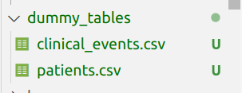
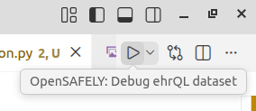
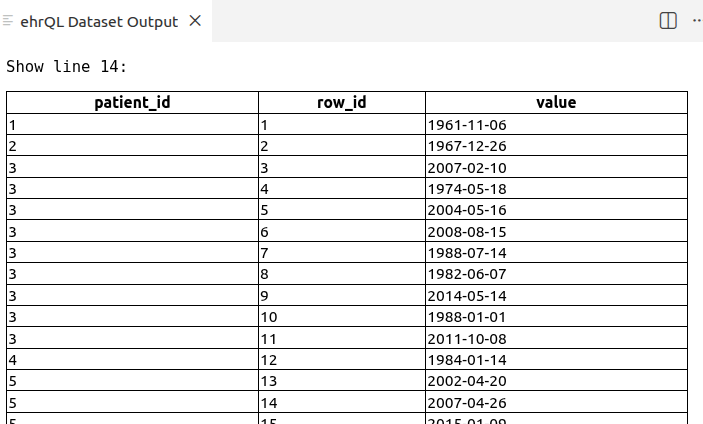
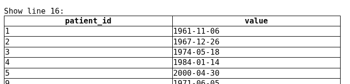

An alternative to letting ehrQL generate a dummy dataset - the output of a dataset definition - is to provide
**dummy tables**, which ehrQL will use as its input to generate the dataset.

You provide dummy tables as a collection of CSV files. You can think of these CSV files as a representation of the
underlying database tables holding the EHR data that ehrQL queries.

ehrQL will use the dummy tables as the backend data from which to extract the dataset. You can refer to the
[table schema reference](https://docs.opensafely.org/ehrql/reference/schemas/) in the OpenSAFELY documentation for a guide to the available tables and columns.

## Generating dummy tables from a dataset definition

Setting up lots of dummy tables from scratch can be tedious. However, we can use ehrQL to help us generate the tables

Under the hood, ehrQl generates dummy **datasets** by first creating dummy **tables**, and then running the queries in
the dataset definition on them. We can have ehrQL output those dummy tables directly, rather than the dummy dataset.

:octicons-terminal-16: Using your dataset definition file, create dummy tables and write them to the `dummy_tables`
directory. In your terminal, run:

```sh
opensafely exec ehrql:v1 create-dummy-tables analysis/dataset_definition.py dummy_tables
```

:eyes: Have a look at the files in the `dummy_tables` folder; there will be 2 CSV files corresponding to the two tables that this dataset definition uses.



## The ehrQL `show()` function
Now that we have some dummy tables, we can take advantage of the `show()` function and the [OpenSAFELY VSCode extension][1].

The `show()` function lets you explore the data in the dummy tables using ehrQL, and look at how your
ehrQL queries affect how the data that is filtered and extracted.

:fontawesome-solid-code: `analysis/dataset_definition.py`
Update the dataset definition to add a `show` statement before and after our
definition of events. Here we can have a look at the date column from the full (dummy) clinical events
table, and then the column after we've filtered to just the first event for each patient.

```py
from ehrql import create_dataset, show
...
# show the date column from the original clinical_events table
show(clinical_events.date)
# filter to a patient frame, with the first event for each patient
first_event_date = clinical_events.sort_by(clinical_events.date).first_for_patient().date
# show the date column from the filtered first_events frame
show(first_event_date)
...
```

Click on the Run button in the bottom right.



This will open a new panel and display the columns we requested.




(Note that the line numbers correspond to the lines with the `show()` in your dataset definition file and may not exactly match the screenshots above.)

## Running ehrQL with dummy tables

Once you've created some dummy tables, you can then use those tables as the input when you run your dataset
definition again. Or you can use them as a starting point to generate more data, or to test your
dataset definition is extracting data as you’d expect.

:octicons-terminal-16: Run your dataset extraction again, this time with the dummy tables:
```sh
opensafely exec ehrql:v1 generate-dataset analysis/dataset_definition.py --dummy-tables dummy_tables
```

Note that this produces the same output dataset as before, because the tables we've created are the
*same* tables that ehrQL generated behind the scenes in order to create the dummy dataset.

Let's check that the dataset definition is extracting patients by age as we expect, by manually
changing some data in the tables.

Open `dummy_tables/patients.csv` and modify the date of birth for the first two patients to make patient 1 too old and patient 2 too young to match our dataset definition:
```sh hl_lines="2 3"
patient_id,date_of_birth,date_of_death,sex
1,1901-01-01,,unknown
2,2025-01-01,,intersex
3,1970-04-01,,male
4,1945-08-01,,unknown
5,1996-09-01,,unknown
6,1955-07-01,,unknown
7,1979-11-01,,unknown
8,1951-09-01,,unknown
9,1970-06-01,1991-07-08,unknown
10,1969-06-01,,unknown
```

:octicons-terminal-16: Re-run the dataset extraction with the dummy tables again, and note that patient
1 and 2 are no longer included:
```sh
opensafely exec ehrql:v1 generate-dataset analysis/dataset_definition.py --dummy-tables dummy_tables
```

```sh
patient_id,age,sex,first_event_date
3,49,male,1988-12-06
4,74,unknown,1967-06-01
5,23,unknown,1998-09-03
6,64,unknown,
7,40,unknown,
8,68,unknown,
9,49,unknown,1974-10-17
10,50,unknown,1973-04-05
...
```

## Using ehrQL to create dummy tables to test a dataset definition

Another strategy is to use ehrQL to build the dummy tables you want, and then feed those into your dataset
definition to see if it extracts the patients you expect.


:fontawesome-solid-code:
Create a new dataset definition file called `analysis/dataset_definition_london_adults.py`, with the
ehrQL code below.

This dataset definition is intended to extract patients who are aged 18-80 and are in the city of London
(MSOA code E02000001).

!!! warning
    There is a deliberate error in this dataset definition. If you spot it, don't
    worry, we'll be finding it soon!

```py
from ehrql import create_dataset
from ehrql.tables.core import patients
from ehrql.tables.tpp import addresses


min_age = 18
max_age = 80

age = patients.age_on("2024-01-01")

dataset = create_dataset()
dataset.age = age

london_msoa = (
    addresses
    .where((addresses.msoa_code == "E02000001").is_not_null())
    .sort_by(addresses.start_date)
    .last_for_patient()
)

dataset.define_population(
    (age >= min_age)
    & (age <= max_age)
    & london_msoa.exists_for_patient()
)
dataset.msoa = london_msoa.msoa_code
```

If we ask ehrQL to generate dummy tables from this dataset definition, all patients will have MSOA
E02000001, because that makes them satisfy the dataset definition.


:octicons-terminal-16: Run this dataset definition

```sh
opensafely exec ehrql:v1 generate-dataset analysis/dataset_definition_london_adults.py
```
The output is as expected, and contains 10 patients, all within the expected age range and with the correct MSOA code.
```sh
[info   ] Building dataset and writing results
patient_id,age,msoa
1,66,E02000001
2,67,E02000001
3,49,E02000001
4,75,E02000001
7,39,E02000001
8,71,E02000001
9,49,E02000001
12,71,E02000001
14,41,E02000001
17,67,E02000001
```

:octicons-terminal-16:  Output the dummy tables using the dataset definition:

```sh
opensafely exec ehrql:v1 create-dummy-tables analysis/dataset_definition_london_adults.py dummy_tables
```

This outputs dummy tables to the `dummy_tables` folder; this time there is an additonal `addresses.csv` table
that is needed for the `dataset_definition_london_adults` that we've just run. If you take a look at the
addresses table, you'll see that it that ONLY contains null values and the code E02000001 (which is
present for every patient in at least one row).

```sh
patient_id,msoa_code,start_date
1,E02000001,1997-11-17
1,E02000001,1991-04-16
1,,1997-05-05
1,E02000001,1961-07-14
2,E02000001,1976-09-19
2,,1979-10-25
2,,1964-07-01
2,E02000001,1972-05-21
2,E02000001,1960-09-18
2,,1956-04-27
2,E02000001,1991-12-09
2,E02000001,1970-06-09
3,E02000001,1993-07-08
3,E02000001,2015-03-14
3,E02000001,1995-11-28
...
```

But, we want to make sure that our dataset definition successfully extracts patients with MSOA code
E02000001 from patients with other MSOAs, and patients who have no MSOA available at all. And we want to
check that it can extract patients of the right age from wider data; i.e. does it properly exclude patients
who are too old/young?

To do this, let's write a different dataset definition that just produces the tables. This will include the
data we want, but also allows for producing patients who have no address data, patients whose MSOA code is
different, and patients who are outside the age range.

:fontawesome-solid-code:

:fontawesome-solid-code:
Create a new file called `analysis/dummy_data_london_adults.py`.


1. First define the dataset and add an age variable, using the same index date as the previous dataset definition.

    ```py
    from ehrql import create_dataset
    from ehrql.tables.core import patients
    from ehrql.tables.tpp import addresses

    dataset = create_dataset()
    dataset.configure_dummy_data(population_size=50)
    age = patients.age_on("2024-01-01")
    ```

1. Now defines some possible MSOAs, including the target "E02000001".
    ```py
    ...
    possible_msoas = ["E02000001", "E02000002", "E02000003", "E02000004"]
    ```

1. Define an address variable that selects patients who have data in the addresses table, where the MSOA code is one of these possible codes.

    ```py
    ...
    address = (
    addresses
    .where(addresses.msoa_code.is_in(possible_msoas))
    .sort_by(addresses.end_date)
    .last_for_patient()
    )
    ```
1. And define a variable that selects patients who have NO address data:

    :fontawesome-solid-code:
    ```py
    ...
    no_address = ~addresses.exists_for_patient()

    ```

1. Add the age column to the output dataset - this will make sure relevant columns are included in the dummy patient table. We also add the msoa code, just so we can check what's being produced.

    ```py
    ...
    dataset.age = age
    dataset.msoa = address.msoa_code
    ```

1. Finally, define our population to include patients of any age, who either have a matching
address or no address data at all.

    ```py
    ...
    dataset.define_population(
        patients.exists_for_patient()
        & (address.exists_for_patient() | no_address)
    )
    ```

Your final dataset definition file should look like this:

```
from ehrql import create_dataset
from ehrql.tables.core import patients
from ehrql.tables.tpp import addresses

dataset = create_dataset()
dataset.configure_dummy_data(population_size=50)
age = patients.age_on("2024-01-01")

possible_msoas = ["E02000001", "E02000002", "E02000003", "E02000004"]

address = (
    addresses
    .where(addresses.msoa_code.is_in(possible_msoas))
    .sort_by(addresses.end_date)
    .last_for_patient()
)

no_address = ~addresses.exists_for_patient()

dataset.age = age
dataset.msoa = address.msoa_code

dataset.define_population(
    patients.exists_for_patient()
    & (address.exists_for_patient() | no_address)
)
```

:octicons-terminal-16: Generate a dataset from this dummy data definition:
```sh
opensafely exec ehrql:v1 generate-dataset analysis/dummy_data_definition_london_adults.py
```
We get a set of patients, only some of whom will match our actual dataset definition.

```sh
[info   ] Building dataset and writing results
patient_id,age,msoa
1,94,E02000003
2,98,E02000002
3,62,E02000002
4,111,E02000002
5,7,E02000004
7,41,E02000002
8,104,E02000001
9,60,E02000002
10,60,
12,105,E02000002
...
```

:octicons-terminal-16:  Output these dummy tables:

```sh
opensafely exec ehrql:v1 create-dummy-tables analysis/dummy_data_definition_london_adults.py dummy_tables
```

:octicons-terminal-16:  Now use them to generate a dataset from the actual dataset definition:

```sh
opensafely exec ehrql:v1 generate-dataset analysis/dataset_definition_london_adults.py --dummy-tables dummy_tables
```

!!! bug "Something is wrong!"
    The dataset produced when we run the dataset definition with our dummy tables
    is producing patients with other MSOAs. There's a bug in our dataset definition that we need
    to fix. The output from our dataset definition currently looks like this (note the highlighted lines
    with unexpected MSOA codes):

    ```sh hl_lines="2 3 4 6 7 8 9"
    patient_id,age,msoa
    3,62,E02000003
    7,41,E02000002
    9,60,E02000002
    14,45,E02000001
    19,53,E02000003
    23,59,E02000004
    26,73,E02000002
    30,59,E02000003
    ...
    ```


The offending line in `analysis/dataset_definition_london_adults.py` is:

```py
.where((addresses.msoa_code == "E02000001").is_not_null())
```

`is_not_null()` here is incorrect (it's assessing whether the result of the clause
`msoa_code == "E02000001"`is not null, which is not what we meant). Fix it by changing this line to:

```py
.where(addresses.msoa_code == "E02000001")
```

:octicons-terminal-16:  Now rerun the corrected dataset definition with the dummy tables.

```sh
opensafely exec ehrql:v1 generate-dataset analysis/dataset_definition_london_adults.py --dummy-tables dummy_tables
```

And verify that our dataset definition is now extracting only the patients who match our
criteria:

```sh
[info   ] Building dataset and writing results
patient_id,age,msoa
7,41,E02000001
14,45,E02000001
19,53,E02000001
26,73,E02000001
38,73,E02000001
43,24,E02000001
47,51,E02000001
51,35,E02000001
56,68,E02000001
```


???+ example "Generating dummy tables: prevalence of death from heart failure for hospitalised patients"

    The following dataset definition that identifies patients who have an ONS death record with an underlying
    cause of death recorded, and who were hospitalised 6 months before their death.

    It also extracts information about where the patients live, and their underlying cause of death
    (an ICD-10 code). A downstream analysis script will use this data to analyse regional
    variations in the cause of death, and identify the prevalence of ICD-10 codes for heart failure
    (I50, I500, I501, I509) by region.

    ```
    from ehrql import create_dataset, months
    from ehrql.tables.core import patients, ons_deaths
    from ehrql.tables.tpp import apcs, practice_registrations


    study_start_date = "2022-01-01"
    study_end_date = "2023-01-01"

    died_in_study_period = ons_deaths.date.is_on_or_between(
        study_start_date, study_end_date
    )

    hospitalisation_in_6_months_before_death = (
        apcs
        .where(
            apcs.admission_date.is_on_or_between(
                (ons_deaths.date - months(6)), ons_deaths.date
            )
        )
        .sort_by(apcs.admission_date)
        .last_for_patient()
    )
    hospitalised_date = hospitalisation_in_6_months_before_death.admission_date

    # registration info at ons-registered date of death
    registration = practice_registrations.for_patient_on(ons_deaths.date)

    dataset = create_dataset()

    dataset.region = registration.practice_nuts1_region_name

    dataset.cause_of_death = ons_deaths.underlying_cause_of_death
    dataset.date_of_death = ons_deaths.date

    dataset.hospitalised_date = hospitalised_date

    dataset.define_population(
        died_in_study_period
        & hospitalised_date.is_not_null()
        & ons_deaths.underlying_cause_of_death.is_not_null()
    )
    ```

    First copy this ehrQL code into a new dataset definition file, try running it look at the dummy
    dataset it produces.

    As the underlying cause of death is not used as a filter in the dataset definition, ehrQL produces
    random strings of characters as cause of death, rather than valid ICD-10 codes. This means that the
    dummy dataset will not be sufficient for downstream analysis that wants to categorise the data
    by ICD-10 codes representing cause of death.

    Write a dummy tables definition and use it to create dummy tables that can be used as an input to
    this dataset definition to produce a dataset with valid hospitalisation dates and ICD-10 codes.

    Your dummy tables should include a range of ICD-10 codes, in order to allow downstream analyses
    to categorise them and calculate prevalence. It should also include hospitalisation dates and
    death dates outside of the dataset definition boundaries to ensure that they are correctly
    filtered out.

    Note that the original dataset definition does not need to be modified in any way.


Next: [Limitations of native ehrQL dummy data](../limitations-of-native-ehrQL-dummy-data/index.md)

---

[1]: ../../../explanation/vscode-extension.md
